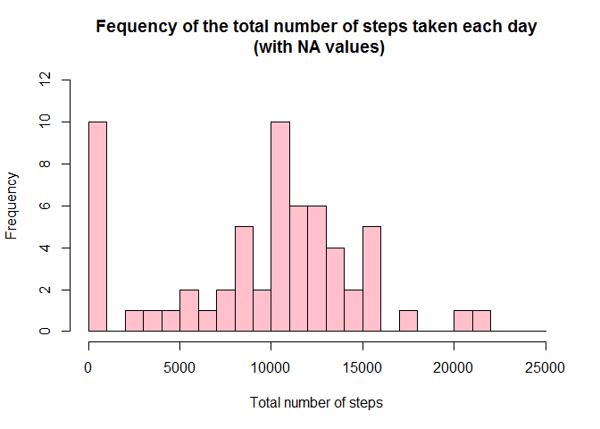
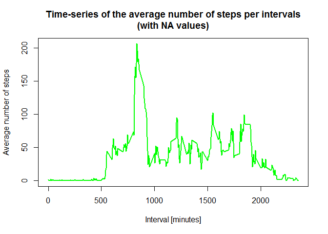
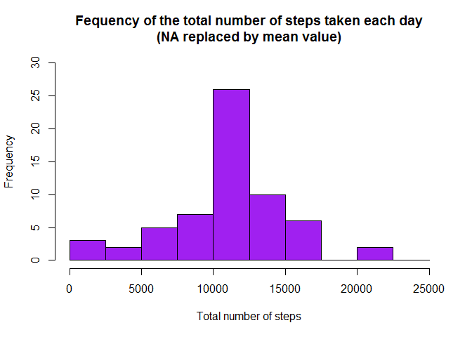
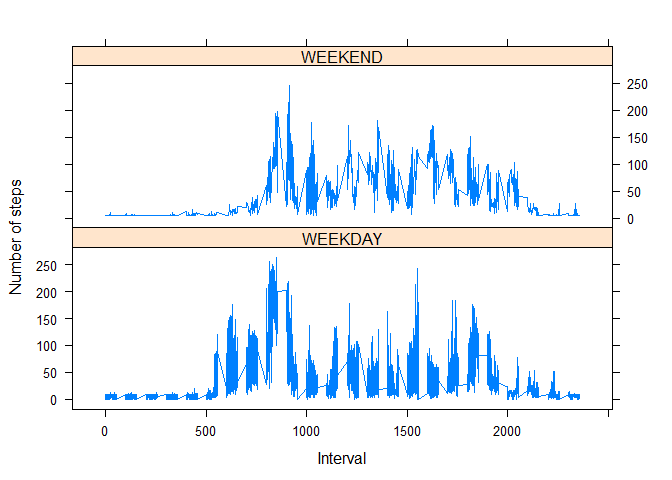

# Reproducible Research: Peer Assessment 1

By: Zuraidah M Sany              

Date: 29 November 2016

### Setting up the working directory

```r
rm(list=ls())
setwd('C:/Users/User/Desktop/Coursera/RepData_PeerAssessment1/')
library (lattice)
library(ggplot2)
```

```
## Warning: package 'ggplot2' was built under R version 3.3.2
```

### Loading and preprocessing the data
The data has been downloaded and unzipped into the working directory.Data is then loaded as 'activity_raw'.

```r
activity_raw <- read.csv("activity.csv", stringsAsFactors=FALSE)
```

Preprocessing the data by transforming the date attribute to an actual date format.Then compute the week days (Monday-Sunday) from the date attribute. Followed by computing the day type (weekend or weekday).

```r
activity_raw$date <- as.POSIXct(activity_raw$date, format="%Y-%m-%d")

activity_raw <- data.frame(date=activity_raw$date, 
                           weekday=tolower(weekdays(activity_raw$date)), 
                           steps=activity_raw$steps, 
                           interval=activity_raw$interval)
```

A new final data.frame is created called Activity

```r
activity <- data.frame(date=activity_raw$date, 
                       weekday=activity_raw$weekday, 
                       interval=activity_raw$interval,
                       steps=activity_raw$steps)
```


### What is mean total number of steps taken per day?

1) The total number of steps taken per day (with NA values) is then calculated. Attributes changed accordingly.

```r
sum_data <- aggregate(activity$steps, by=list(activity$date), FUN=sum, na.rm=TRUE)
names(sum_data) <- c("Date", "Total")
sum_data
```

```
##          Date Total
## 1  2012-10-01     0
## 2  2012-10-02   126
## 3  2012-10-03 11352
## 4  2012-10-04 12116
## 5  2012-10-05 13294
## 6  2012-10-06 15420
## 7  2012-10-07 11015
## 8  2012-10-08     0
## 9  2012-10-09 12811
## 10 2012-10-10  9900
## 11 2012-10-11 10304
## 12 2012-10-12 17382
## 13 2012-10-13 12426
## 14 2012-10-14 15098
## 15 2012-10-15 10139
## 16 2012-10-16 15084
## 17 2012-10-17 13452
## 18 2012-10-18 10056
## 19 2012-10-19 11829
## 20 2012-10-20 10395
## 21 2012-10-21  8821
## 22 2012-10-22 13460
## 23 2012-10-23  8918
## 24 2012-10-24  8355
## 25 2012-10-25  2492
## 26 2012-10-26  6778
## 27 2012-10-27 10119
## 28 2012-10-28 11458
## 29 2012-10-29  5018
## 30 2012-10-30  9819
## 31 2012-10-31 15414
## 32 2012-11-01     0
## 33 2012-11-02 10600
## 34 2012-11-03 10571
## 35 2012-11-04     0
## 36 2012-11-05 10439
## 37 2012-11-06  8334
## 38 2012-11-07 12883
## 39 2012-11-08  3219
## 40 2012-11-09     0
## 41 2012-11-10     0
## 42 2012-11-11 12608
## 43 2012-11-12 10765
## 44 2012-11-13  7336
## 45 2012-11-14     0
## 46 2012-11-15    41
## 47 2012-11-16  5441
## 48 2012-11-17 14339
## 49 2012-11-18 15110
## 50 2012-11-19  8841
## 51 2012-11-20  4472
## 52 2012-11-21 12787
## 53 2012-11-22 20427
## 54 2012-11-23 21194
## 55 2012-11-24 14478
## 56 2012-11-25 11834
## 57 2012-11-26 11162
## 58 2012-11-27 13646
## 59 2012-11-28 10183
## 60 2012-11-29  7047
## 61 2012-11-30     0
```

2) Histogram of the total number of steps taken each day

```r
hist(sum_data$Total,
      breaks=seq(from=0, to=25000, by=1000),
     
      col="pink", 
      xlab="Total number of steps", 
      ylim=c(0, 12),    
      main="Fequency of the total number of steps taken each day\n (with NA values)")
```

<!-- -->

3) The mean of the total number of steps taken per day:

```r
mean(sum_data$Total)
```

```
## [1] 9354.23
```
The median of the total number of steps taken per day:

```r
median(sum_data$Total)
```

```
## [1] 10395
```
### What is the average daily activity pattern?
Compute the means of steps accross all days for each interval and rename the attributes

```r
mean_data <- aggregate(activity$steps, 
                       by=list(activity$interval), 
                       FUN=mean, 
                       na.rm=TRUE)
      
names(mean_data) <- c("interval", "mean")
```

1) The time series plot of the 5-minute interval (x-axis) and the average number of steps taken, averaged across all days (y-axis) would be:

```r
plot(mean_data$interval, 
           mean_data$mean, 
           type="l", 
           col="green", 
           lwd=2, 
           xlab="Interval [minutes]", 
           ylab="Average number of steps", 
           main="Time-series of the average number of steps per intervals\n(with NA values)")
```

<!-- -->
 
2) Find the position of the maximum mean. Look up for the value of interval at this position. 

```r
max_pos <- which(mean_data$mean == max(mean_data$mean))
max_interval <- mean_data[max_pos, 1]
```

The 5-minute interval that contains the maximum number of steps is:

```r
max_interval
```

```
## [1] 835
```

### Imputing missing values
1) Calculate and report the total number of missing values in the dataset (i.e. the total number of rows with NAs)

```r
NA_count <- sum(is.na(activity$steps))
```

The total number of NAs is:

```r
NA_count
```

```
## [1] 2304
```
    
2) The strategy is to fill in all of the missing values in the dataset with the mean of the steps attribute. So first, the NA positions needs to be identified. Then prepare a vector that replace each NA value by the mean of the steps attribute.

```r
           na_pos <- which(is.na(activity$steps))
           mean_vec <- rep(mean(activity$steps, na.rm=TRUE), times=length(na_pos))
```

3) A new dataset that is equal to the original dataset but with the missing data filled in is then created. 

```r
activity[na_pos, "steps"] <- mean_vec
```

For validation that all NAs has been replaced, the number of NAs is now:

```r
NA_count <- sum(is.na(activity$steps))
NA_count
```

```
## [1] 0
```
4) A histogram of the total number of steps taken each day is created. Then calculate and report the mean and median total  number of steps taken per day. 

```r
      sum_data <- aggregate(activity$steps, by=list(activity$date), FUN=sum)
      names(sum_data) <- c("date", "total")

      hist(sum_data$total, 
                   breaks=seq(from=0, to=25000, by=2500),
                   col="purple", 
                   xlab="Total number of steps", 
                   ylim=c(0, 30), 
                   main="Fequency of the total number of steps taken each day\n(NA replaced by mean value)")
```

<!-- -->

The mean of the total number of steps taken per day

```r
mean(sum_data$total)
```

```
## [1] 10766.19
```
The median of the total number of steps taken per day

```r
median(sum_data$total)
```

```
## [1] 10766.19
```
After replacing all the missing values in the dataset with the mean of the steps attribute, it can be seen that the mean had increased from 9354.23 to 10766.19. The median increased from 10395 to 10766.19. It can be concluded that by imputing missing data, the total daily number of steps is actually much higher.

### Are there differences in activity patterns between weekdays and weekends?

1. Create a new factor variable in the dataset with two levels - "weekday" and "weekend" indicating whether a given date is a weekday or weekend day.

```r
activity_new <- cbind(activity, 
                daytype=ifelse(activity$weekday == "sabtu" | 
                               activity$weekday == "ahad","WEEKEND","WEEKDAY"))

summary(activity_new)
```

```
##       date              weekday        interval          steps       
##  Min.   :2012-10-01   ahad  :2304   Min.   :   0.0   Min.   :  0.00  
##  1st Qu.:2012-10-16   isnin :2592   1st Qu.: 588.8   1st Qu.:  0.00  
##  Median :2012-10-31   jumaat:2592   Median :1177.5   Median :  0.00  
##  Mean   :2012-10-31   khamis:2592   Mean   :1177.5   Mean   : 37.38  
##  3rd Qu.:2012-11-15   rabu  :2592   3rd Qu.:1766.2   3rd Qu.: 37.38  
##  Max.   :2012-11-30   sabtu :2304   Max.   :2355.0   Max.   :806.00  
##                       selasa:2592                                    
##     daytype     
##  WEEKDAY:12960  
##  WEEKEND: 4608  
##                 
##                 
##                 
##                 
## 
```
                               
Based on the summary, it can be seen that the data is now segegrated between WEEKDAY and WEEKEND.

2. The average number of steps taken, averaged across all day type variable. Rename the attributes

```r
                  mean_data <- aggregate(activity_new$steps, 
                               by=list(activity_new$daytype, 
                               activity_new$weekday, activity$interval), mean)

                  names(mean_data) <- c("daytype", "weekday", "interval", "mean")
```
A panel plot containing a time series plot (i.e. type = "l") of the 5-minute interval (x-axis) and the average number of steps taken, averaged across all weekday days or weekend days (y-axis).              # Compute the time series plot

```r
          xyplot(mean ~ interval | daytype, mean_data, 
                         type="l", 
                         lwd=1, 
                         xlab="Interval", 
                         ylab="Number of steps", 
                         layout=c(1,2))
```

<!-- -->
